<p align="center">
  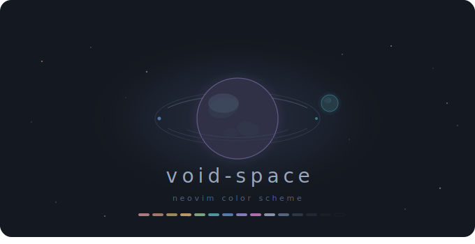
</p>

A dark Neovim colorscheme inspired by deep space and nebula texture. Vivid but sober, low contrast by design. Full TreeSitter, LSP, diagnostics, and [LazyVim](https://wwww.lazyvim.org/) plugin coverage.

## Examples

<table>
  <tr>
    <td>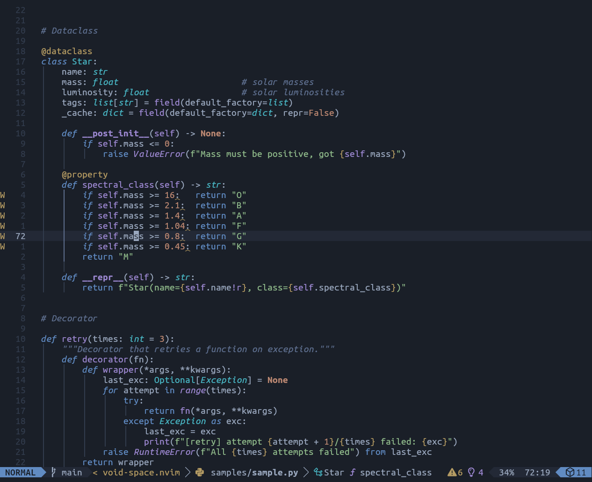</td>
    <td>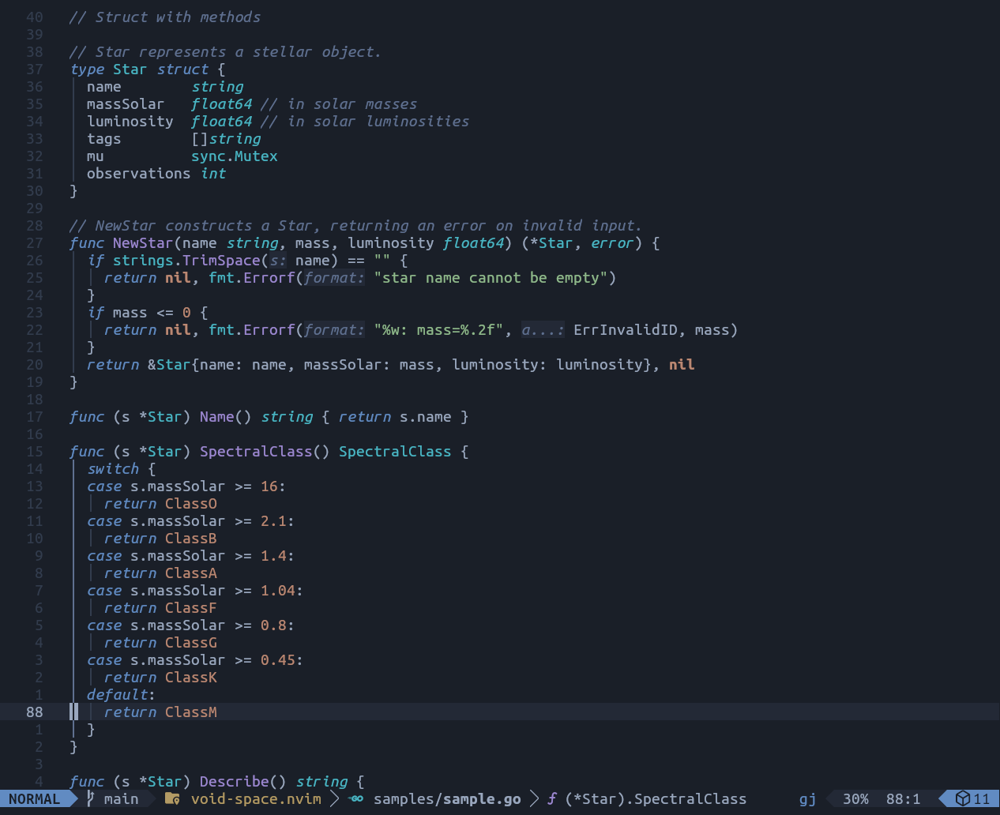</td>
  </tr>
  <tr>
    <td>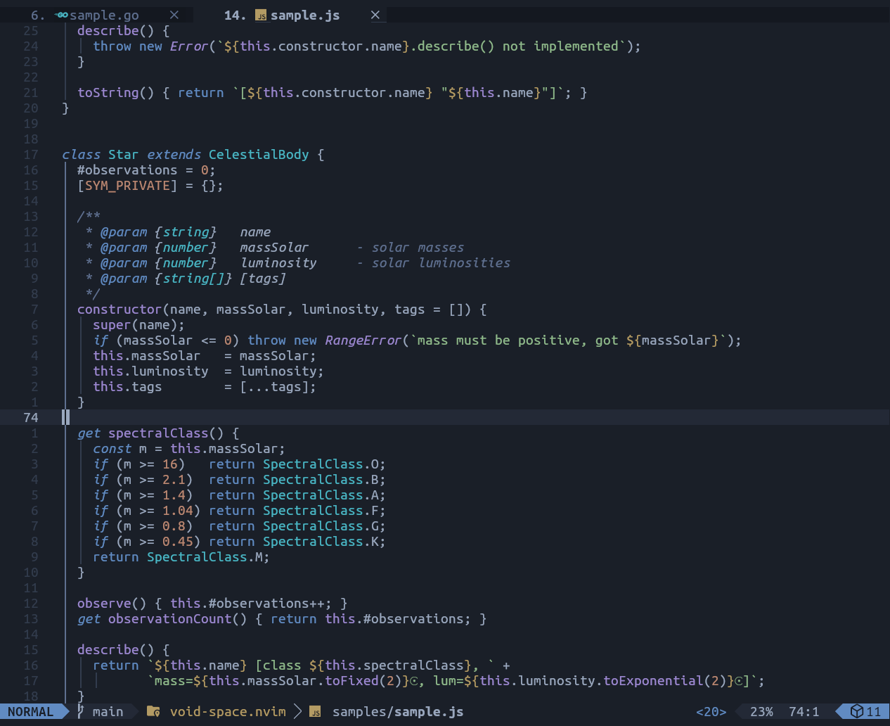</td>
    <td>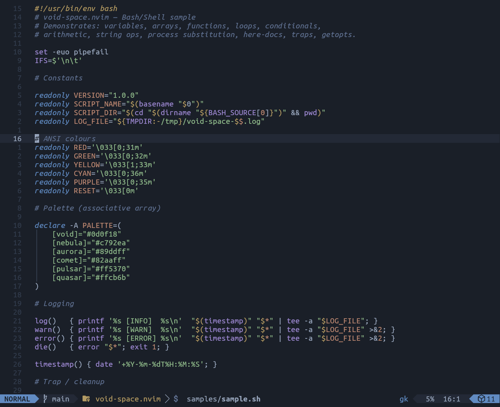</td>
  </tr>
</table>

## Palette

See [docs/PALETTE.md](docs/PALETTE.md) for the full palette reference — identity, HSL principles, and color justifications.

<p align="center">
     <br>
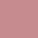 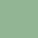   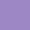    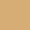
</p>

## Requirements

- Neovim >= 0.8
- `termguicolors` enabled

## Installation

### [lazy.nvim](https://github.com/folke/lazy.nvim)

```lua
{
  'viniciusfs/void-space.nvim',
  lazy = false,    -- must be loaded at startup
  priority = 1000, -- load before other UI plugins
  opts = {
    italic_comments  = true,
    italic_keywords  = false,
    transparent      = false,
    dim_inactive     = false,
    -- on_highlights = function(hl, c)
    --   hl.CursorLine = { bg = c.sel }
    -- end,
  },
  config = function(_, opts)
    require('void-space').setup(opts)
    vim.cmd('colorscheme void-space')
  end,
}
```

## Usage

### Minimal (just activate it)

```lua
vim.cmd('colorscheme void-space')
```

### With setup (call before `colorscheme`)

```lua
require('void-space').setup({
  italic_comments  = true,   -- italicize comments
  italic_keywords  = false,  -- italicize keywords / conditionals
  transparent      = false,  -- transparent Normal background
  dim_inactive     = false,  -- dim inactive windows
})

vim.cmd('colorscheme void-space')
```

### LazyVim integration

```lua
-- In your lazy.nvim spec:
{
  'viniciusfs/void-space.nvim',
  lazy = false,
  priority = 1000,
  opts = {
    italic_comments = true,
    italic_keywords = false,
  },
  config = function(_, opts)
    require('void-space').setup(opts)
    vim.cmd('colorscheme void-space')
  end,
},

-- Tell LazyVim which colorscheme to use (in your LazyVim options):
{
  'LazyVim/LazyVim',
  opts = { colorscheme = 'void-space' },
},
```

### Overriding specific highlights

Use the `on_highlights` callback to tweak any group after the theme loads. The callback receives the full highlights table and the palette so you can reference any color:

```lua
require('void-space').setup({
  on_highlights = function(hl, c)
    -- Make the cursor line more visible
    hl.CursorLine = { bg = c.sel }

    -- Use a brighter yellow for search
    hl.Search = { fg = c.bg, bg = c.bright_yellow }

    -- Transparent floating windows
    hl.NormalFloat = { fg = c.fg, bg = c.none }
    hl.FloatBorder = { fg = c.fg_dim, bg = c.none }
  end,
})
```

### Lualine

The theme is picked up automatically when lualine's `theme` option is set. Use the theme name that matches the active variant:

```lua
require('lualine').setup({
  options = { theme = 'void-space' },           -- default variant
  -- options = { theme = 'void-space-nebula' },       -- nebula variant
  -- options = { theme = 'void-space-cosmic-dawn' },  -- cosmic_dawn variant
})
```

### Variants (Experimental)

Two additional variants are available: **nebula** and **cosmic_dawn**. Both are experimental — palette and highlight assignments may still change between releases.

<table>
  <tr>
    <td align="center"><strong>nebula</strong></td>
    <td align="center"><strong>cosmic_dawn</strong></td>
  </tr>
  <tr>
    <td>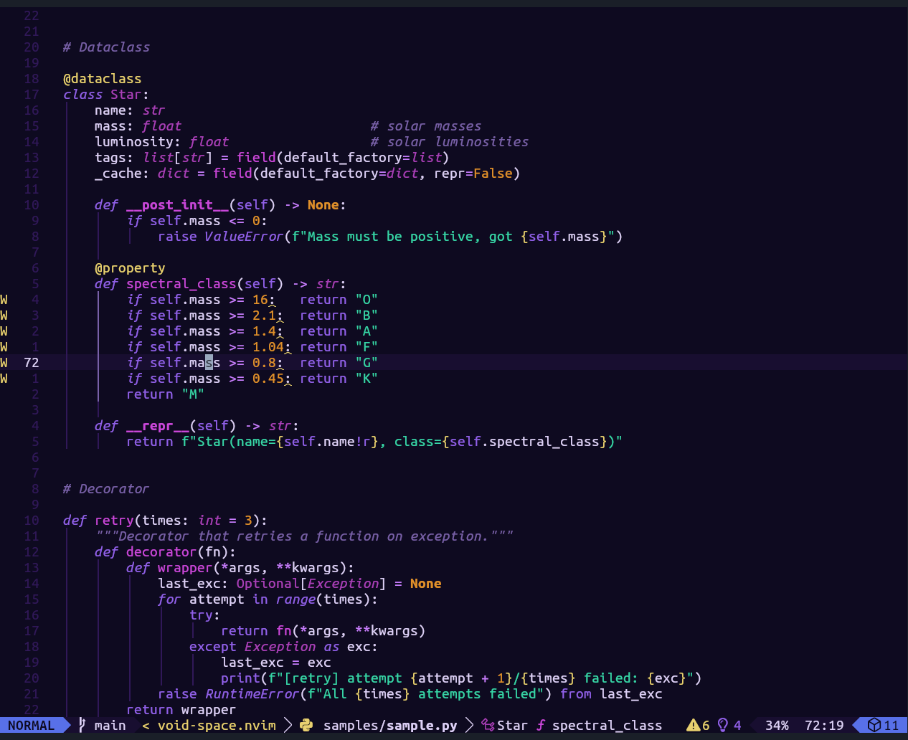</td>
    <td>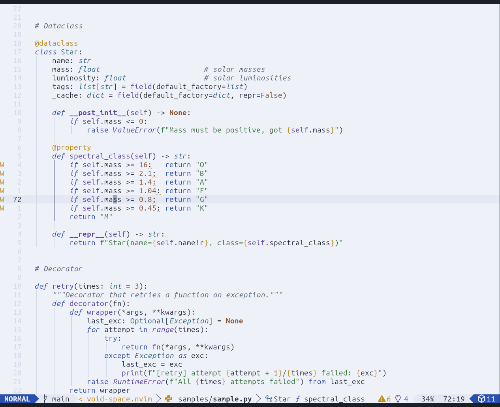</td>
  </tr>
</table>

To activate a variant, set the `variant` option in `setup()`:

```lua
require('void-space').setup({ variant = 'nebula' })       -- or 'cosmic_dawn'
vim.cmd('colorscheme void-space')
```

## Plugin support

| Plugin | Highlight definition |
|--------|----------------------|
| [bufferline.nvim](https://github.com/akinsho/bufferline.nvim) | [highlights/plugins/bufferline.lua](lua/void-space/highlights/plugins/bufferline.lua) |
| [blink.cmp](https://github.com/Saghen/blink.cmp) | [highlights/plugins/cmp.lua](lua/void-space/highlights/plugins/cmp.lua) |
| [dashboard-nvim](https://github.com/nvimdev/dashboard-nvim) | [highlights/plugins/dashboard.lua](lua/void-space/highlights/plugins/dashboard.lua) |
| [fidget.nvim](https://github.com/j-hui/fidget.nvim) | [highlights/plugins/fidget.lua](lua/void-space/highlights/plugins/fidget.lua) |
| [flash.nvim](https://github.com/folke/flash.nvim) | [highlights/plugins/flash.lua](lua/void-space/highlights/plugins/flash.lua) |
| [gitsigns.nvim](https://github.com/lewis6991/gitsigns.nvim) | [highlights/plugins/gitsigns.lua](lua/void-space/highlights/plugins/gitsigns.lua) |
| [illuminate.nvim](https://github.com/RRethy/vim-illuminate) | [highlights/plugins/illuminate.lua](lua/void-space/highlights/plugins/illuminate.lua) |
| [indent-blankline.nvim](https://github.com/lukas-reineke/indent-blankline.nvim) | [highlights/plugins/indent.lua](lua/void-space/highlights/plugins/indent.lua) |
| [lazy.nvim](https://github.com/folke/lazy.nvim) | [highlights/plugins/lazy.lua](lua/void-space/highlights/plugins/lazy.lua) |
| [lualine.nvim](https://github.com/nvim-lualine/lualine.nvim) | [lualine/themes/void-space.lua](lua/lualine/themes/void-space.lua) |
| [mini.nvim](https://github.com/echasnovski/mini.nvim) | [highlights/plugins/mini.lua](lua/void-space/highlights/plugins/mini.lua) |
| [neo-tree.nvim](https://github.com/nvim-neo-tree/neo-tree.nvim) | [highlights/plugins/neo\_tree.lua](lua/void-space/highlights/plugins/neo_tree.lua) |
| [noice.nvim](https://github.com/folke/noice.nvim) | [highlights/plugins/noice.lua](lua/void-space/highlights/plugins/noice.lua) |
| [nvim-cmp](https://github.com/hrsh7th/nvim-cmp) | [highlights/plugins/cmp.lua](lua/void-space/highlights/plugins/cmp.lua) |
| [nvim-notify](https://github.com/rcarriga/nvim-notify) | [highlights/plugins/notify.lua](lua/void-space/highlights/plugins/notify.lua) |
| [render-markdown.nvim](https://github.com/MeanderingProgrammer/render-markdown.nvim) | [highlights/plugins/render\_markdown.lua](lua/void-space/highlights/plugins/render_markdown.lua) |
| [snacks.nvim](https://github.com/folke/snacks.nvim) | [highlights/plugins/snacks.lua](lua/void-space/highlights/plugins/snacks.lua) |
| [telescope.nvim](https://github.com/nvim-telescope/telescope.nvim) | [highlights/plugins/telescope.lua](lua/void-space/highlights/plugins/telescope.lua) |
| [todo-comments.nvim](https://github.com/folke/todo-comments.nvim) | [highlights/plugins/todo\_comments.lua](lua/void-space/highlights/plugins/todo_comments.lua) |
| [trouble.nvim](https://github.com/folke/trouble.nvim) | [highlights/plugins/trouble.lua](lua/void-space/highlights/plugins/trouble.lua) |
| [which-key.nvim](https://github.com/folke/which-key.nvim) | [highlights/plugins/which\_key.lua](lua/void-space/highlights/plugins/which_key.lua) |

## License

[MIT](LICENSE)
